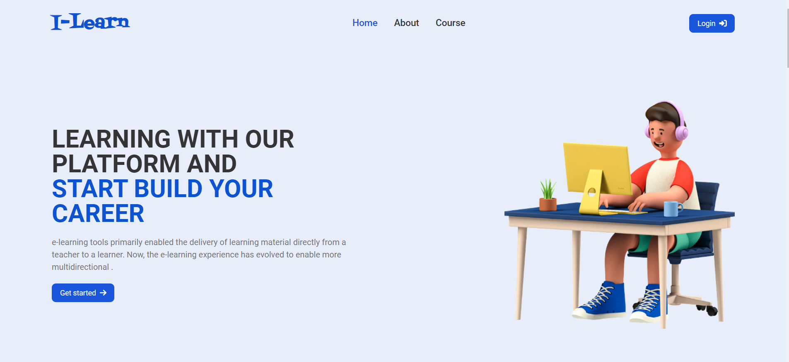

# I-Learn

 

  

<!-- TABLE OF CONTENTS -->

  
<h3>Table of Contents</h3>

  <ol>
    <li>
      <a href="#about">About I-learn</a>
    </li>
    <li>
      <a href="#getting-started">Getting Started</a>
      <ul>
        <li><a href="#local-installation">Local Installation</a></li>
        <li><a href="#deployment">Deployment</a></li>
      </ul>
    </li>
    <li><a href="#page-url">Page URL</a></li>
  </ol>

<!-- ABOUT THE PROJECT -->

## About

 
 
 
<h4>I-Learn is a static website that build for mini project for CSTAD requirement of studying IT Expert 
    Courses
</h4>

(<a href="#readme-top">back to top</a>)

<!-- GETTING STARTED -->
## Getting Started

### Local Installation

1. Clone the repo
   
   git clone https://github.com/YithSopheaktra8/e-learning-mini-project.git
   
2. Run the project with live server
   
   
Open [http://localhost:5500](http://localhost:5500) with your browser to see the result.

### Deployment

Deployment: https://e-learning-mini-project.vercel.app/

(<a href="#readme-top">back to top</a>)

<!-- Page URL -->
## Page URL

01. [Home](https://e-learning-mini-project.vercel.app/)
02. [About Us](https://e-learning-mini-project.vercel.app/pages/aboutUs.html) 
03. [Course](https://e-learning-mini-project.vercel.app/pages/course.html) 